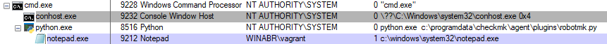
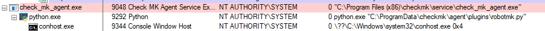
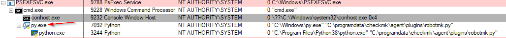

# RobotMK Plugin-Ausführung als angemeldeter User

## Ziel

**Ausführung von Robot-Tests in der Windows-Sitzung des aktuell angemeldeten Benutzers**


Windows-Dienste (wie der Checmk-Agent) sind von Benutzerprozessen durch die "Session ID" getrennt, d.h. Dienste laufen grundsätzlich mit ID 0, alle anderen Prozesse mit ID 1. Kommunikation/Interaktion zwischen diesen Bereichen ist per se nicht vorgesehen und muss programmatisch gelöst werden. 

Webbasierte Robot-Tests können problemlos vom Checkmk-Agenten getriggert werden; sie laufen dann ebenfalls unter `NT AUTHORITY/SYSTEM` und Sesion ID 0; die Browser arbeiten dann headless. 

Robot-Tests als "normaler" Benutzer starten zu müssen, kann folgende Gründe haben: 

* Einsatz von Libraries, die auf den Bildschirminhalt zugreifen müssen, um Bitmap-Vergleiche durchzuführen (Sikuli, ImageHorizonLibrary, ...)
* Testen von Applikationen, die ein bestimmtes Benutzerpropfil erfordern (Datenzugriff/Anmeldung)

Das RobotmK-PLugin muss deshalb imstande sein, die Ausführung eines Robot-Tests ggf. auf dem Desktop des angemeldeten Benutzers zu starten. 

Dises Minimalbeispiel ist reduziert auf die Ausführung von `notepad.exe` auf dem User-Desktop.


## Installation Minimalbeispiel

* Checkmk-Agenten installieren
* Python für Windows (vorher ggf. in den Windows-Einstellungen nach "Alias" suchen und die Ausführungs-Aliase für Python entfernen)
* Zum Debuggen: Sysinternal Tools (https://docs.microsoft.com/en-us/sysinternals/downloads/)
* Agenten-Config-Datei `C:\ProgramData\checkmk\agent\bakery\check_mk.bakery.yml` anlegen: 
```
global:
  enabled: true
  execute: exe bat vbs ps1 py
  port: 6556
plugins:
  enabled: true
  execution:
    - pattern: $CUSTOM_PLUGINS_PATH$\robotmk.py
      cache_age: 240
      async: yes
      timeout: 180
```
* Python-Plugin `robotmk.py` in `C:\ProgramData\checkmk\agent\plugins` ablegen

## Tests

### 1) OK: Manueller Aufruf als SYSTEM 

```
C:\Users\vagrant>psexec -s cmd.exe

PsExec v2.2 - Execute processes remotely
Copyright (C) 2001-2016 Mark Russinovich
Sysinternals - www.sysinternals.com


Microsoft Windows [Version 10.0.19041.508]
(c) 2020 Microsoft Corporation. All rights reserved.

C:\Windows\system32>cd \

C:\>python.exe c:\programdata\checkmk\agent\plugins\robotmk.py

```

Das Script startet aus dem SYSTEM-Kontext heraus erfolgreich `notepad` sichtbar auf dem Desktop von Benutzer "vagrant": 




Das Script wartet, bis der Editor geschlossen wird und beendet sich dann. 

`c:\robotmk.log`:

```
2020-09-22 08:25:56,656 DEBUG - Starting: c:\windows\system32\notepad.exe
2020-09-22 08:25:56,656 DEBUG - Nach Start
2020-09-22 08:25:59,818 DEBUG - Prozess beendet, rc: 0
```

### 2) NOK: Aufruf über CheckMK-Agent

Agenten-Service starten, `robotmk.py` wird automatisch als Plugin aufgerufen. 



Man sieht, dass sowohl die SYSTEM-cmd, als auch der Checkmk-Agent unter dem selben User laufen (SYSTEM), in der selben Session ID (0). 
Das Plugin stirbt aber kurz nach dem Start und zeigt im Log folgenden Fehler: 

```
2020-09-22 08:43:55,227 DEBUG - Starting: c:\windows\system32\notepad.exe
2020-09-22 08:43:55,228 ERROR - (5, 'CreateProcessAsUser', 'Access is denied.')
```

Der gleiche Fehler wird auch geloggt, wenn der cmk-Agent über die SYSTEM-cmd manuell getriggert wird: 

```
check_mk_agent.exe test
```


## bereits geprüft

* Die Environments der SYSTEM-cmd.exe und des check_mk_agent sind fast identisch (der Agent hat noch MK-spezifische Variablen)
* Problem existiert auch auf anderem Betriebssystem (kein "Inselproblem")
* Mit ProcessMonitor (Sysinternals) bereits versucht, den beiden augenscheinlich identisch Aufrufen hinterherzustalken, aber da kommt man in den Wald. 

# Working Examples
* https://www.programmersought.com/article/54251019809/ => 
* https://mail.python.org/pipermail/python-win32/2008-October/008341.html


## Fragen 

* Wo ist der Unterschied im Aufruf über SYSTEM-cmd.exe und den Dienst? Was hat die SYSTEM-cmd.exe, was der cmk-Agent-Dienst nicht hat? 
* Was soll die Meldung `Access is denied` sagen? Zugriff auf *was*?
* Rolle des Interpreters beim Aufruf, siehe folgender Abschnitt

### Welche Rolle spielt der Interpreter? 

Keinen Reim kann ich mir machen auf diesen Effekt: 

Ruft man das Plugin die in 1) auf, jedoch **ohne** den Interpreter anzugeben, so schlägt es ebenfalls fehl: 

```
C:\Program Files (x86)\checkmk\service> c:\programdata\checkmk\agent\plugins\robotmk.py
Traceback (most recent call last):
  File "C:\programdata\checkmk\agent\plugins\robotmk.py", line 184, in <module>
    run_process('c:\\windows\\system32\\notepad.exe')
  File "C:\programdata\checkmk\agent\plugins\robotmk.py", line 88, in run_process
    win32event.WaitForSingleObject(proc_handle, win32event.INFINITE)
UnboundLocalError: local variable 'proc_handle' referenced before assignment
```

(Der `Unbound`-Fehler ist ein Folgefehler, weil das Script nicht abbricht und danach auf das Handle zugreifen will, welches natürlich nicht existiert. )

`c:\robotmk.log`:

```
2020-09-22 09:08:24,976 DEBUG - Starting: c:\windows\system32\notepad.exe
2020-09-22 09:08:24,976 ERROR - (5, 'CreateProcessAsUser', 'Access is denied.')
2020-09-22 09:08:24,976 DEBUG - Nach Start
```

Interessanterweise wird im ProcessExplorer sichtbar, dass zunächst `py.exe` (Python Windows Starter) gestartet wird, und hiervon wiederum `python.exe`.



Der Fehler, der beim Start über den Dienst kommt, lässt sich so zwar auf der cmdline nachstellen, allerdings: baut man in das Script zu Beginn einen langen `sleep(100)` ein, so sieht man im ProcessExplorer, dass der Agent den Aufruf-Umweg über `py.exe` nicht zu nehmen scheint. Also doch ein anderer Fehler? 


## Referenzen

* http://dcuktec.blogspot.com/2009/05/python-on-windows-from-service-launch.html - hiervon stammt die Idee, den angemeldeten User aus der win32ts auszulesen
* https://mail.python.org/pipermail/python-win32/2008-October/008341.html : 

```
The long and the short of it, if you have a service that needs to
interact with the user, then the basic outline of the steps you will
need to perform is:

    session = WTSGetActiveConsoleSessionId() *[1]
    <add SE_TCB_NAME privilege>
    token = WTSQueryUserToken(session)
    CreateProcessAsUser(token, ...)
    <remove SE_TCB_NAME privilege>
    token.Close()
```

## Doku

* Win32modules Übersicht: http://timgolden.me.uk/pywin32-docs/win32_modules.html
  * CreateProcessAsUser: http://timgolden.me.uk/pywin32-docs/win32process__CreateProcessAsUser_meth.html


* MS Win32 API: 
  * OpenProcessToken: https://docs.microsoft.com/en-us/windows/win32/api/processthreadsapi/nf-processthreadsapi-openprocesstoken
  * LookupPrivilegeValue: https://docs.microsoft.com/en-us/windows/win32/api/winbase/nf-winbase-lookupprivilegevaluea
  * AdjustTokenPrivileges: https://docs.microsoft.com/en-us/windows/win32/api/securitybaseapi/nf-securitybaseapi-adjusttokenprivileges
  * TOKEN_PRIVILEGES struct: https://docs.microsoft.com/en-us/windows/win32/api/winnt/ns-winnt-token_privileges

* Misc
  * Token von Explorer.exe holen? https://stackoverflow.com/questions/18628985/createprocessasuser-not-working
  * https://stackoverflow.com/questions/2967742/logonuser-createprocessasuser-from-a-system-service 
  * https://docs.microsoft.com/en-us/windows/win32/api/processthreadsapi/nf-processthreadsapi-createprocessasusera: "Typically, the process that calls the CreateProcessAsUser function must have the SE_INCREASE_QUOTA_NAME privilege and may require the SE_ASSIGNPRIMARYTOKEN_NAME privilege if the token is not assignable. If this function fails with ERROR_PRIVILEGE_NOT_HELD (1314), use the CreateProcessWithLogonW function instead. CreateProcessWithLogonW requires no special privileges, but the specified user account must be allowed to log on interactively. Generally, it is best to use CreateProcessWithLogonW to create a process with alternate credentials."
